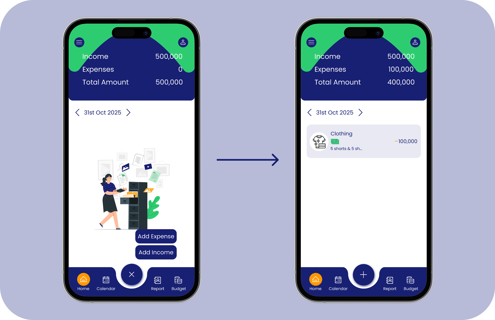

- [Onboarding](#onboarding)
- [Homepage](#homepage)
- [Account creation](#account-creation)
- [Budget Creation](#budget-creation)
- [Adding expense](#adding-expense)
- [Adding Income](#adding-income)
- [Calendar](#calendar)
- [Report](#report)

## Onboarding

The onboarding process takes users into the app's interface after completing three tasks, which include:

1. Welcome screen: The welcome screen provides a brief overview of the app's purpose and lets users read or skip the introduction.
2. Currency setup: Zeno supports ten different currencies. The user must select one to proceed.
3. Password setup: Every user must create a password to protect their information   

## Homepage  

The homepage contains all navigation paths for using Zeno. 

* The top: Two icons are present, the left icon leads to a menu bar, and the right icon leads to avatar settings. In between is a summary card displaying income, expenses, and amounts. 
* The center: Contains the date navigator, which helps users move between dates, and a list of recorded expenses and income. 
* The bottom: Contains icons leading to the home, calendar, report, and budget screens. Between the calendar and report, a large plus sign icon for expenses and income is shown. 
   
A visual reference:

  

## Account creation

An account must be created in Zeno before you can create a budget. The account holds the money for your budget, allowing you to allocate and track it. Without an account, you cannot create a budget because Zeno requires you to select an account when creating one. The steps to create an account include:

1. Tap report from the bottom navigation bar.
2. Click the "Add new account" button.
3. Enter the account name, amount, and currency.
4. Tap the checkmark in the upper-right corner to save.

Upon successful creation, the account screen appears.

  

## Budget Creation

Budgeting is the main feature of the Zeno app. It helps users track both large and small financial goals by assigning funds to different needs and wants. The budget creation process follows these steps:

1. Tap budget from the bottom navigation bar.
2. Click the "Add budget" button.
3. Select a category you want to add, such as clothes or electronics.
4. Add the account name and amount.
5. Add a start date and recurrence if you wish.
6. Tap the checkmark in the upper-right corner to save.

Upon successful creation, the budget screen appears.

  

## Adding expense  

Budgeting helps allocate funds and track financial goals. Expenses in Zeno show what the money was spent on, how much was spent, where it was spent, when it was spent, and the mode of payment. The creation process follows these steps:

1. Click on the plus-signed button at the center of the bottom navigation to roll up the add options.
2. Select the "Add expense" option.
3. Select a category you want to add, such as clothes or electronics.
4. Add the account name, amount, and description. 
5. Tap the checkmark in the upper-right corner to save.

Upon successful creation, the expense screen appears.

  

## Adding Income

Expenses reduce the available balance, while income increases it. The budget creation process follows these steps:

1. Click on the plus-signed button at the center of the bottom navigation to open the add options.
2. Select the "Add income" option.
3. Select a category you want to add, such as grant or salary.
4. Add the account name, amount, and description. 
5. Tap the checkmark in the upper-right corner to save.

Upon successful creation, the income update appears.

  

## Calendar

Zeno calendar saves daily transactions in detail, allowing users to view their history.

1. Tap calendar from the bottom navigation bar.

Once you're on the calendar:

* Tap a day to view its transactions.
* Use the date navigator to move between months.
* Tap a transaction to view its full details.

  

## Report

The report shows the monthly, yearly, and budget overview. It helps users stay on track with their spending and budgeting habits.

1. Tap report on the bottom navigation bar.
2. Tap reports on the shared account and reports page to open the reports screen.
3. Select one of the three overviews to view a detailed breakdown by month, day, or budget.

  

